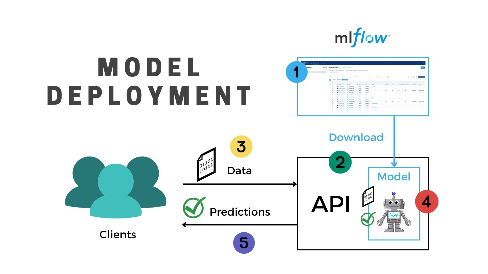
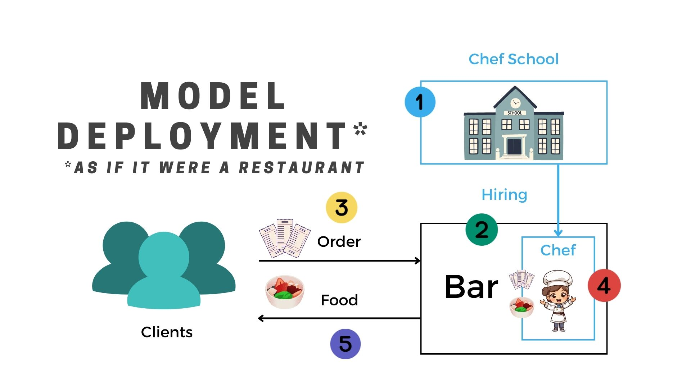

# Model Deployment

Imagine **you've trained a model to predict** whether an email is **spam** or not. **Serving the model means deploying it so that it can analyze incoming emails** and decide whether each new email is spam or not in real time. This process is often referred to as "model deployment" or "model serving."

!!! info "What "serving a model" means?"
    Serving a model means making a trained machine learning **model available for use in real-time applications** or services. When you serve a model, **it's like putting it to work** so that it can make predictions or classifications on new, incoming data.

Serving a model typically involves setting up a server or service that can receive input data, send it through the model, and provide the model's predictions or results as output. It allows the model to be used by other applications or systems, such as in recommendation systems, fraud detection, or any task where predictions are needed on the fly.

## Model Deployment Workflow

Serving a model using MLflow is a bit like setting up a **restaurant** (API) where you have a **chef** (your trained model) who can cook **dishes** (make predictions) for **customers** (incoming data).

!!! tip "Comparing Serving a Model with a Chef in a Restaurant"

    👇 Click to compare

    === "Regular Model Serving"

        

    === "Model Deployment as if it were a restaurant"

        

Here's how it works:

1. **Training the Chef (Model)**: First, you train your chef by creating and fine-tuning your machine learning model using data. It's like teaching the chef how to cook your special recipes.

2. **Opening the Restaurant (Deployment)**: Once your chef is ready, you need a restaurant (a server or service) to serve the dishes (predictions). In MLflow, you can use the Model Registry to manage different versions of your chef's recipes (models) and choose which one to serve.

3. **Taking Orders (Incoming Data)**: People come to your restaurant and place orders (send data). For example, they might ask, "Is this email spam?" Your restaurant receives these orders (data) and sends them to your chef (model) to make predictions.

4. **Chef Makes Predictions (Model Serving)**: The chef (model) follows the recipe (model instructions) and prepares the dish (provides predictions) based on the order (incoming data).

5. **Serving the Dish (Sending Predictions)**: The chef serves the cooked dish (predictions) to the customers (applications or users) who requested it.

MLflow helps you manage and keep track of the chef's recipes (model versions) and ensures that everything runs smoothly in your "restaurant" by managing model deployments, making it easier to serve your machine learning models to applications and users in real time.

## Deploy a model using MLFLow

Mlflow provides a [simple way to **generate an API**](https://mlflow.org/docs/latest/cli.html#mlflow-models-serve) (the restaurant) using [Flask](https://flask.palletsprojects.com/en/3.0.x/) with a simple command:

!!! note "Command to deploy a model from MLFlow"
    ```shell
    mlflow models serve --model-uri models:/<model_name>/<model_stage>
    ```

!!! warning "Flask must be installed"

    === "Using Pip"
        ```shell
        pip install flask
        ```

    === "Using Poetry"
        ```shell
        poetry add flask
        ```

You can create a markdown table for these options as follows ([original source](https://mlflow.org/docs/latest/cli.html#cmdoption-mlflow-models-serve-m)) :

| Option             | Description                                                                                                                          | Default      |
|--------------------|--------------------------------------------------------------------------------------------------------------------------------------|--------------|
| -m, --model-uri    | Required URI to the model. A local path, a 'runs:/' URI, or a remote storage URI (e.g., an 's3://' URI). For more information about supported remote URIs for model artifacts, see [here](https://mlflow.org/docs/latest/tracking.html#artifact-stores). | -            |
| -p, --port         | The port to listen on.                                                                                             | 5000         |
| -h, --host         | The network address to listen on. Use 0.0.0.0 to bind to all addresses if you want to access the tracking server from other machines. | 127.0.0.1    |
| -t, --timeout      | Timeout in seconds to serve a request.                                                                               | 60           |
| -w, --workers      | Number of gunicorn worker processes to handle requests.                                                              | 1            |
| --env-manager      | If specified, create an environment for MLmodel using the specified environment manager. The following values are supported: - local: use the local environment - virtualenv: use virtualenv (and pyenv for Python version management) - conda: use conda If unspecified, default to virtualenv. | virtualenv   |
| --no-conda         | If specified, use local environment.                                                                                                | -            |
| --install-mlflow  | If specified and there is a conda or virtualenv environment to be activated, mlflow will be installed into the environment after it has been activated. The version of installed mlflow will be the same as the one used to invoke this command. | -            |
| --enable-mlserver | Enable serving with MLServer through the v2 inference protocol. You can use environment variables to configure MLServer. (See [here](https://mlserver.readthedocs.io/en/latest/reference/settings.html)) | -            |

!!! Example "Changing the port of the API"

    By default the **port** is set to the **5000**, we can change it to the **8888** by:

    ```shell
    mlflow models serve --model-uri models:/<model_name>/<model_stage> --port 8888
    ```

!!! Example "Change the timeout for serving requests"

    By default the **timeout** is set to **60 seconds**, we can change it to **10 seconds** by:

    ```shell
    mlflow models serve --model-uri models:/<model_name>/<model_stage> --timeout 10
    ```