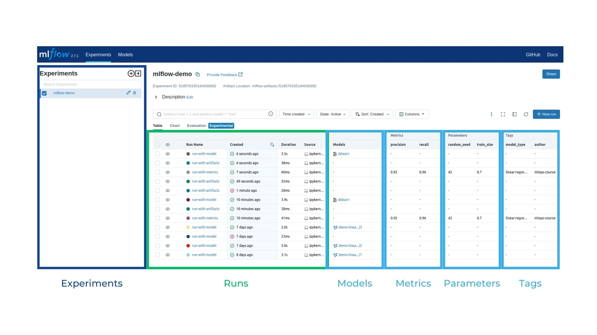

# What is MLFlow?

Remember that **you are a scientist** (of data), and as a good scientist, you should keep a record of all your experiments. Well, **imagine MLflow as a book where you can jot down all your progress**.

For example, imagine you are trying to develop a model that predicts the price of a house based on a series of parameters like the year of construction or the square footage. As a data scientist, your job is to research and experiment with different approaches to build an accurate model. This is very much like a writer working on their book.

## How to install MLFlow?

Its really simple! 😃 You can install MLFlow with the following command:

```bash
pip install mlflow
```

## How to launch MLFlow?

Once you have installed MLFlow, you can launch it with the following command:

```bash
mlflow ui
```

This will launch a server in your local machine. You can access it by going to [http://localhost:5000](http://localhost:5000) in your web browser.

## How does MLFlow look like?



This is the frontend of MLFlow. It is a web application that allows you to keep track of your experiments. You can see the different experiments you have run, the parameters you have used, the metrics you have measured, and the artifacts you have generated.
