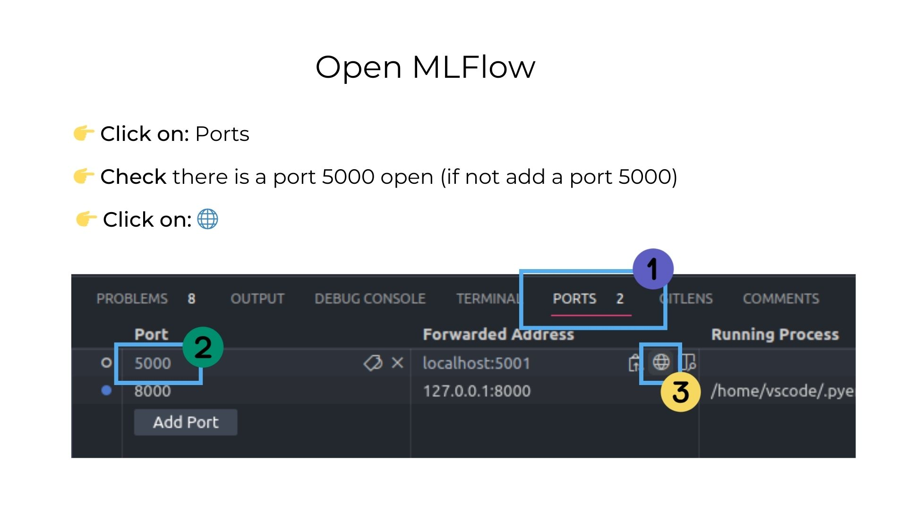
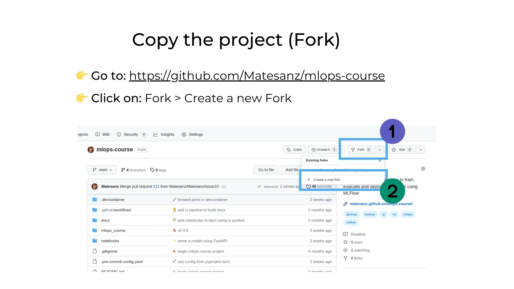
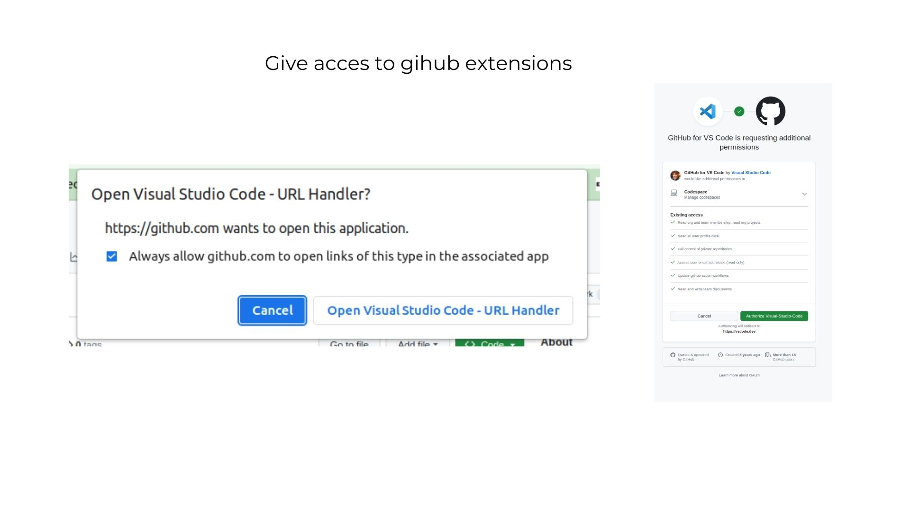
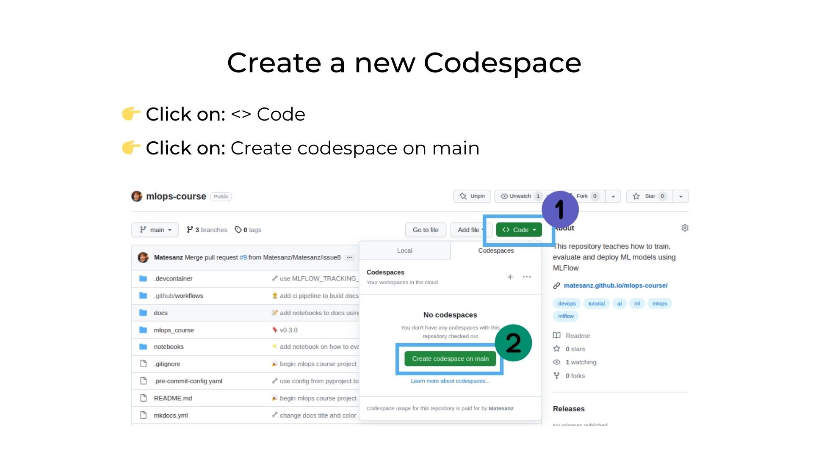
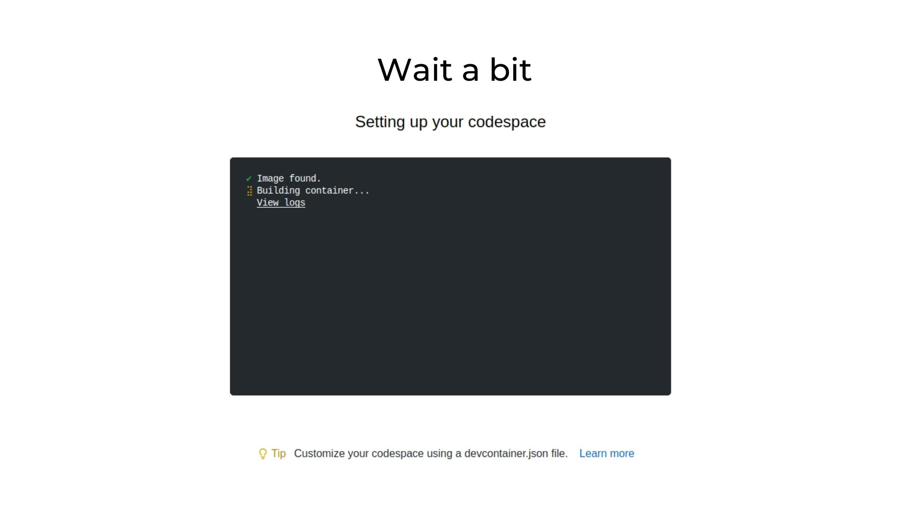
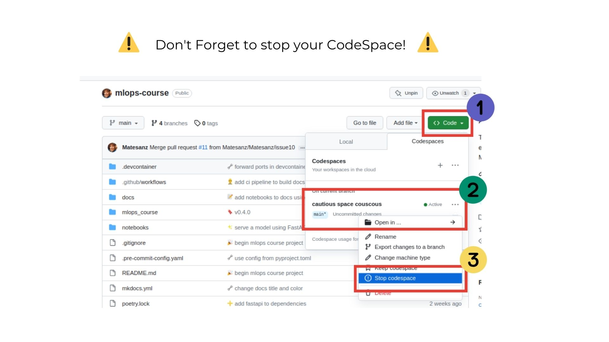

# Setting Up the Environment

!!! success "Setup everything in a few minutes"
    Thanks to the magic of **Docker** and **VSCode** we can launch a running environment really quick! 🎉

You can choose how to do it:

- 👉 [Setting the environment in my own computer](#local-environment)
- 👉 [Setting the environment using Github Codespaces](#github-codespaces)

## Local Environment

Thanks to the magic of the **[DevContainers](https://medium.com/@matesanz.cuadrado/one-dev-environment-to-rule-them-all-devcontainers-90b50c78e9f6)** we can simply, clone the repo, open VSCode and launch a full ready environment **clicking a single button**. 😄

!!! warning "You need Docker Installed"

    In order to use **DevContainers you need to have Docker installed** in your computer. If you don't have it, you can **download it from [here](https://docs.docker.com/get-docker/)**.

!!! note "Install the VSCode pluggin "Dev-Containers""

    In order to use DevContainers you need to have the VSCode pluggin [Dev Containers](https://marketplace.visualstudio.com/items?itemName=ms-vscode-remote.remote-containers).

    You can do it **manually**:

    

    Or by **pressing**:

    1. Press `Ctrl+P`
    2. Paste `ext install ms-vscode-remote.remote-containers`
    3. Press `Enter`

### 1. Clone the repository

!!! note "Run this command"

    ```shell
    git clone `https://github.com/<your_user>/mlops-course.git`
    ```

### 2. Open VSCode

Launch VSCode and open the folder of the repo.

!!! note "On linux or Mac: Run this command"

    ```shell
    cd mlops-course/
    code .
    ```

### 3. Launch the Devcontainer

**Click on the bottom-right blue button `Reopen in Container`** *(wait, first time takes some time to run)*.


### 4. Open MLFlow

A **MLFlow** server should **start automatically** (thanks to the magic of Docker Compose) **at [http://localhost:5000/](http://localhost:5000/)**. If it did not started automatically (or if you launched VSCode on the web), then follow this instructions:

- 👉 **Click on**: `Ports`
- 👉 **Check** there is a port 5000 open (if not add a port 5000)
- 👉 **Click on**: `🌐`



!!! success "Congrats!"
    **🎉 You are ready to go! 🎉**


## Github Codespaces

GitHub Codespaces is like having a **ready-to-use computer** for writing and testing code, but it's all **online**. Imagine if your coding tools, like your text editor and programming languages, were available on the internet. With GitHub Codespaces, you can write and **run your code in a web browser without needing to install everything on your personal computer**. It's handy for collaborating with others and quickly starting coding projects, kind of like having your coding workspace in the cloud.


!!! info "You need a Github Account"

    In order to access to GitHub Codespaces you need to log in into your account or register if you have no account. Github provides **60 hours** of computing at CodeSpaces **for free!** 🤑

### 1. Create a copy of the repository (fork)

- 👉 **Go to** the oficial repo at [https://github.com/Matesanz/mlops-course](https://github.com/Matesanz/mlops-course)
- 👉 **Click** on `Fork > Create a new Fork`



### 2. Launch a CodeSpace in VSCode

- 👉 **Go to** your fork at `https://github.com/<your_user>/mlops-course`
- 👉 **Click on**: `<> Code` > `Open in` > `Open in Visual Studio Code`


??? warning "Accept all the pop-ups that appear"

    
    

??? tip "Alternative: you can also launch VSCode in the web"

    💡 If you have not installed VSCode at your computer this is a (even more) straightforward way to go.

    - 👉 Go to your fork at `https://github.com/<your_user>/mlops-course`
    - 👉 Click on `Code > Create codespace on main`

    

    - 👉 Wait for the CodeSpace to launch

    

    !!! warning "Don't forget to stop your CodeSpace once you've finished!"
        Remember that you "only" have 60 hours / month of free CodeSpaces. But **no worries** if you forget to do it, after a time of inactivity (if you closed the tab), the CodeSpace will **automatically turn off**. 👍

        

### 3. Open MLFlow

A **MLFlow** server should **start automatically** (thanks to the magic of Docker Compose) **at [http://localhost:5000/](http://localhost:5000/)**. If it did not started automatically (or if you launched VSCode on the web), then follow this instructions:

- 👉 **Click on**: `Ports`
- 👉 **Check** there is a port 5000 open (if not add a port 5000)
- 👉 **Click on**: `🌐`


!!! success "Congrats!"
    **🎉 You are ready to go! 🎉**
