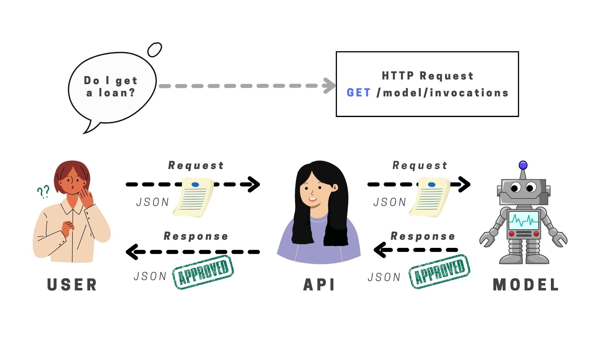
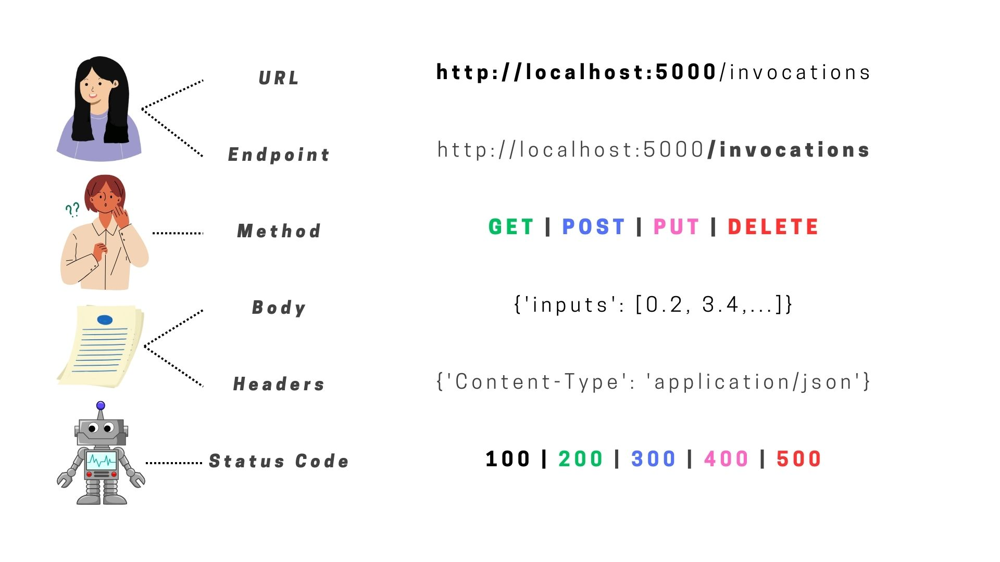

# Introduction to APIs

Imagine you're at a **restaurant** with a menu full of delicious dishes to choose from. You decide what you want and tell the waiter, who then goes to the kitchen to tell the chef exactly what to prepare for you. After a bit of wait, the waiter returns with your order exactly as you requested. In this scenario, think of the **menu** as a list of **services**, **you** as the **user**, the **waiter** as the **messenger**, and the **kitchen** as the system that prepares your **request**. This process is quite similar to how an API, or Application Programming Interface, works in the digital world.

An **API** is essentially a set of **rules, protocols, and tools for building software and applications**. It acts as an **intermediary** that allows two different programs to communicate with each other. Just like the waiter in our restaurant example, an API takes a request from one system (you ordering food), translates it into a format that the other system (the kitchen) can understand, and then delivers the response back to the requesting system (the waiter bringing your food).

## How Does an API Work?

When you use an application on your smartphone or computer, that application connects to the Internet and **sends data to a server**. The server then retrieves that data, interprets it, **performs the necessary actions**, and **sends it back** to your phone or computer. The application then interprets that data and presents you with the information you wanted in a readable way. All this back-and-forth is done through APIs.



## Parts of an API

An API is not just a single element but rather a set of components that work together to enable seamless communication between different software systems. Here are the key parts of an API:



### 1. Endpoints

An endpoint is a specific address (URL) on the web where an API can be accessed by a client application. It's like a specific location in the kitchen where orders are taken and served. Each endpoint is associated with a specific function or resource that the API can provide, such as retrieving user information or posting a message.

### 2. Methods

API methods (or HTTP methods) define what action you want to perform on an endpoint, such as GET to retrieve data, POST to send data to the server, PUT to update data, and DELETE to remove data. These methods correspond to the different types of requests you can make, similar to how you can order food, request a bill, or cancel an order in a restaurant.

!!! tip "Understanding HTTP Methods: GET, POST, PUT, DELETE"

    HTTP methods define the action to be performed on resources identified by URLs. Understanding these methods is crucial for API interaction.

    👇 Click on each method to understand their use

    === "GET"
        
        The `GET` method requests a representation of the specified resource. Requests using `GET` should only retrieve data.

        **Example Use**: Fetching a user's profile information.
        
        ```http
        GET /users/12345
        Url: example.com
        ```

    === "POST"
        
        The `POST` method submits an entity to the specified resource, often causing a change in state or side effects on the server.

        **Example Use**: Creating a new user account.
        
        ```http
        POST /users
        Url: example.com
        Content-Type: application/json

        {
          "name": "John Doe",
          "email": "john@example.com"
        }
        ```

    === "PUT"
        
        The `PUT` method replaces all current representations of the target resource with the request payload.

        **Example Use**: Updating user's profile information.
        
        ```http
        PUT /users/12345
        Url: example.com
        Content-Type: application/json

        {
          "name": "John Doe",
          "email": "john.doe@example.com"
        }
        ```

    === "DELETE"
        
        The `DELETE` method deletes the specified resource.

        **Example Use**: Removing a user's account.
        
        ```http
        DELETE /users/12345
        Url: example.com
        ```

### 3. Request and Response

- **Request:** When a client application wants to communicate with an API, it sends a request. This request includes the endpoint it’s trying to reach, the method it’s using, and any data it needs to send along. It’s like giving your order to the waiter.

- **Response:** After the API processes the request, it sends back a response. This response can include the data requested, confirmation of a new record created, or a status message indicating the success or failure of the request. This is akin to the waiter bringing your order to the table.

### 4. Headers

Headers in an API request and response provide additional information about the request or the data being sent. For example, headers can specify the type of data being sent (JSON, XML), authentication details, or instructions for caching the data. Think of headers as the special instructions you might give when placing an order, like asking for a dish to be extra spicy or to exclude a certain ingredient.

### 5. Payload (Body)

The payload, or body, of an API request is the actual data you send with the request. This is only present in methods that send data to the server, like POST or PUT. In our restaurant analogy, the payload is similar to the specific details of your order, including the dish you want and any special requests.

### 6. Status Codes

Status codes are part of the API response and tell the client application whether the request was successful, and if not, why. Common status codes include 200 (OK), 404 (Not Found), and 500 (Internal Server Error). These codes help the client understand the outcome of their request, much like getting immediate feedback from the waiter on whether your order can be fulfilled.

!!! tip "Understanding HTTP Status Code Families Through a Library Visit"

    👇 Click to explore

    === "100s: Informational Responses"

        Imagine walking into a library and asking if a new book has arrived. The librarian nods and goes to check. This is like the 100s status codes, where the server is saying, "I've received your request and am continuing to process it."

    === "200s: Success"

        You ask for a specific book, and the librarian hands it to you with a smile. This is akin to the 200s status codes, signifying that your request was successfully received, understood, and accepted.

    === "300s: Redirections"

        If you're told the book you're looking for is in another section or even another branch, and you're directed there. The 300s status codes are similar, indicating that more actions need to be taken by the client to fulfill the request.

    === "400s: Client Errors"

        Suppose you request a book title that doesn't exist. The librarian informs you there's no such book. This mirrors the 400s status codes, where the request cannot be fulfilled due to apparent client error (e.g., malformed request syntax, invalid request message framing, or deceptive request routing).

    === "500s: Server Errors"

        Finally, imagine if the library's computer system suddenly goes down while your request is being processed. This situation is represented by the 500s status codes, indicating that the server encountered an unexpected condition that prevented it from fulfilling your request.

Together, these components allow APIs to function as effective intermediaries between different software systems, translating requests into actions and responses into data that can be understood and used by the client application. Understanding these parts can help developers more effectively utilize APIs in their projects.

## Calling an API

Calling an API using python is simple. You can use the `requests` library to send a request to an API endpoint and receive a response. Here's an example of how you can use the `requests` library to call an API:

```python
import requests

endpoint = 'https://jsonplaceholder.typicode.com/todos/1'

response = requests.get(endpoint)
```

## Types of APIs

There are several types of APIs, including:

- **Web APIs**: These are APIs on the internet that allow applications to communicate with each other over the web. For example, when you use a social media app to share a news article, the app uses an API to send the article to the server and then display a confirmation to you.

- **Operating System APIs**: These allow applications to use functions of the operating system, like displaying something on the screen or writing to a file.

- **Database APIs**: These let applications communicate with databases to fetch, create, update, or delete data.

- **Remote APIs**: These are used for communications between devices over a network.

## Why are APIs Important?

APIs are crucial because they enable the integration between different software systems, allowing them to work together. This can make it possible to:

- Automate tasks and improve efficiency.
- Enhance user experience by integrating functionality from various services. For instance, a weather application pulling data from a remote weather API to provide users with the latest weather updates.
- Securely share data between different systems.

In summary, APIs are like the unsung heroes of the digital world, working behind the scenes to connect the technology we use every day. They make it possible for the software to interact seamlessly, automate tasks, and provide the functionalities that users demand in their applications. Without APIs, our experience with technology would be much more fragmented and less efficient.