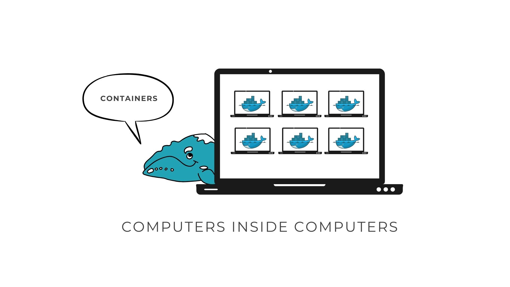
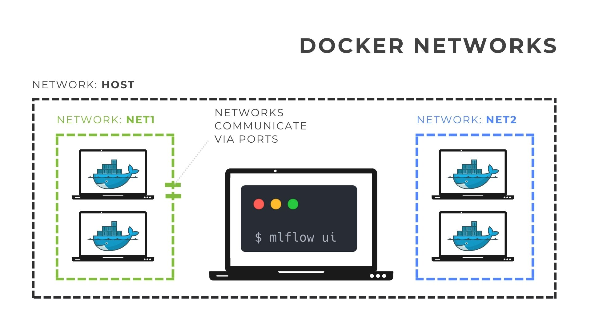

# Introduction to Docker

Docker is a powerful platform that simplifies the process of developing, shipping, and running applications. It utilizes containerization technology to **package an application** and its dependencies **into a single, lightweight** unit known as a **container**.



## What is Docker?

In simple terms, Docker allows you to encapsulate your application and its dependencies into a standardized unit, ensuring that it runs consistently **across various environments**. This is achieved through the use of containers, which are isolated and portable environments that can run seamlessly on any machine supporting Docker.


## Problems Docker Solves

### "It works on my machine"

One common issue in software development is the disparity between development and production environments. With Docker, you can eliminate the infamous "It works on my machine" problem. Containers ensure that your application runs consistently across different stages of development, reducing compatibility issues and streamlining the deployment process.

### Scalability

Docker also addresses scalability challenges. **Containers can be easily replicated and deployed across multiple machines**, providing a scalable and efficient solution. This allows your application to handle increased workloads effortlessly, making Docker an excellent choice for both small and large-scale projects.


## How Docker Works

The Docker workflow involves three main components: Dockerfile, Image, and Container.

1. **Dockerfile**: A Dockerfile is a script that contains instructions for building a Docker image. It specifies the base image, adds dependencies, configures the environment, and sets up the application.

2. **Image**: An image is a lightweight, standalone, and executable package that includes everything needed to run an application. It is created from a Dockerfile and serves as a template for containers.

3. **Container**: A container is an instance of a Docker image. It encapsulates the application and its dependencies, running in isolation from the host system. Containers are portable and can be easily moved between different environments.


## Docker Networks and Ports

Docker provides a networking capability that enables communication between containers and the outside world. Each container can be assigned its own network or share one with others, facilitating seamless interaction. Ports can be mapped between the host and containers, allowing external access to services within the containers.



## Docker Commands

Docker commands play a crucial role in building, managing, and deploying containers. Two fundamental commands are `docker build` and `docker run`, each with various parameters that allow customization and flexibility in containerization workflows.


### `docker run` Command

The `docker run` command is used to create and start a container from a Docker image. Here are some key parameters:

| Parameter          | Description                                                  |
| ------------------ | ------------------------------------------------------------ |
| `-d, --detach`     | Runs the container in the background.                        |
| `--name`           | Assigns a name to the container.                              |
| `-p, --publish`    | Maps host ports to container ports in the format `hostPort:containerPort`. |
| `--network`        | Connects the container to a specific network.                 |
| `-e, --env`        | Sets environment variables inside the container.             |
| `--volume`         | Mounts a volume from the host to the container.               |
| `--restart`        | Sets the container restart policy (`always`, `unless-stopped`, `on-failure`, etc.). |
| `--link`           | Deprecated. Connects containers in a user-defined network.   |

Example:

```bash
docker run -d \
--name myapp-container \
--publish 8080:80 \
--network my-network 
-e MY_ENV=my-value \
myapp:latest
```

These commands and parameters provide a foundation for building and running Docker containers. Understanding their usage is essential for efficiently managing your containerized applications.

!!! tip "Try Docker run"

    A simple docker you can try is the "cow-say" 🐮 image. Run the following command to see a cow saying "Hello, World!".

    ```bash
    docker run rancher/cowsay Hello, World!
    ```

    🐮 result:


    ```bash
    _______________ 
    < Hello, World! >
    --------------- 
            \   ^__^
             \  (oo)\_______
                (__)\       )\/\
                    ||----w |
                    ||     ||

    ```

!!! tip "Run a MLFlow server with Docker"

    You can run a MLFlow server with Docker using the following command:

    ```bash
    docker run --network host ghcr.io/mlflow/mlflow:v2.17.0 mlflow server
    ```

    Then go to `http://localhost:5000` to access the MLFlow server.


!!! tip "Deploy a MLFlow model with Docker"

    You can deploy a MLFlow model with Docker using the following command:

    ```bash
    docker run \
    --net host \
    --env MLFLOW_TRACKING_URI=http://localhost:5000 \
    ghcr.io/mlflow/mlflow:v2.17.0 \
    mlflow models serve \
    --model-uri models:/<model_name>/<model_version> \
    --port 5001 \
    --env-manager local
    ```

    Then go to `http://localhost:1234` to access the MLFlow model.

### `docker build` Command

The `docker build` command is used to create a Docker image from a Dockerfile. Below is an explanation of its essential parameters:

| Parameter          | Description                                                  |
| ------------------ | ------------------------------------------------------------ |
| `-t, --tag`        | Assigns a name and optionally a tag to the image (format: `name:tag`). |
| `-f, --file`       | Specifies the path to the Dockerfile. Default is `./Dockerfile`. |
| `--build-arg`      | Sets build-time variables in the format `key=value`.         |
| `--no-cache`       | Forces Docker to build the image from scratch, ignoring the cache. |
| `--rm`             | Removes intermediate containers after a successful build.     |
| `--target`         | Allows specifying a build stage to stop at when building a multi-stage Dockerfile. |

Example:

```bash
docker build \
-t myapp:latest \
-f ./path/to/Dockerfile .
```

## Docker Hub

[Docker Hub](https://hub.docker.com/) is a cloud-based repository that hosts Docker images. It provides a centralized **platform for sharing, storing, and managing images**, making it easy to access and distribute containerized applications. Docker Hub also supports automated builds, webhooks, and integration with other services, enhancing the development and deployment process.
