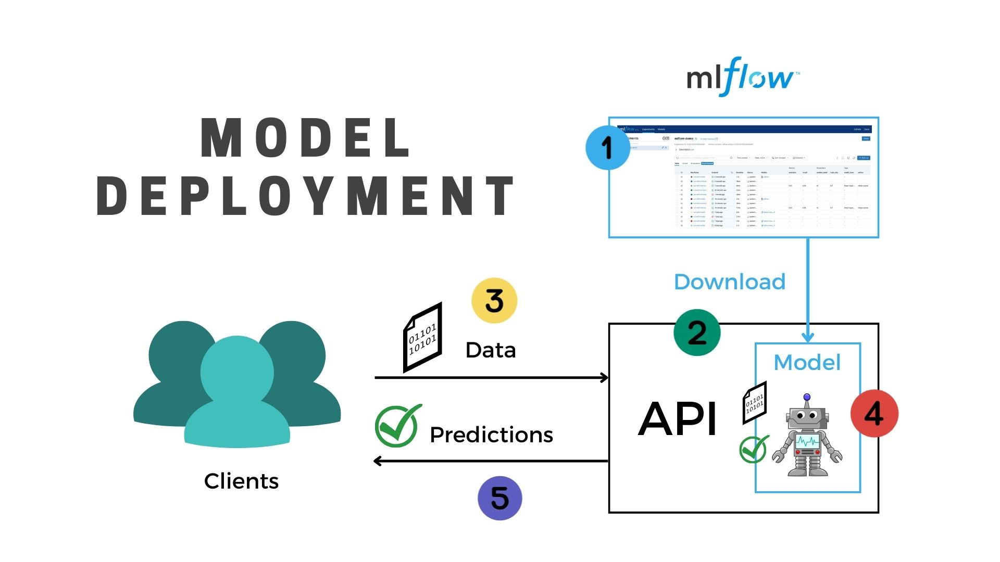
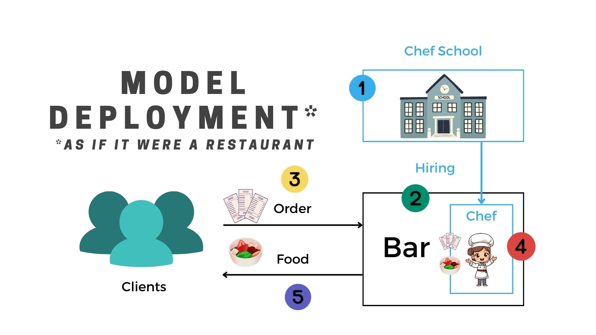

# Model Request

Once the model is deployed into an API we need to learn to "ask" the model for predictions. This is called a **model request**.

!!! info "What is a request?"

    A request is a **message sent from a client to a server** asking for a specific action to be performed. In the context of machine learning, a request is a message sent to a model asking for a prediction to be made. Following the analogy of a restaurant, a request is like a customer placing an order.

!!! tip "Comparing a Model Request with a Customer Order"

    👇 Click to compare

    === "Regular Request"

        

    === "Request as if it were a restaurant"

        

## Parts of a Request

A request is composed of three main parts:

1. **The Request URL**: This is the address where the model is deployed. It is like the address of the restaurant where you want to place your order.
2. **The Request Body**: This is the data you send to the model to make a prediction. It is like the order you place at the restaurant.
3. **The Request Method**: This is the type of request you are making. It can be `GET`, `POST`, `PUT`, `DELETE`, etc. In the context of machine learning, you will mostly use `POST` and `GET` requests. For now think of it as the way you place your order at the restaurant.
