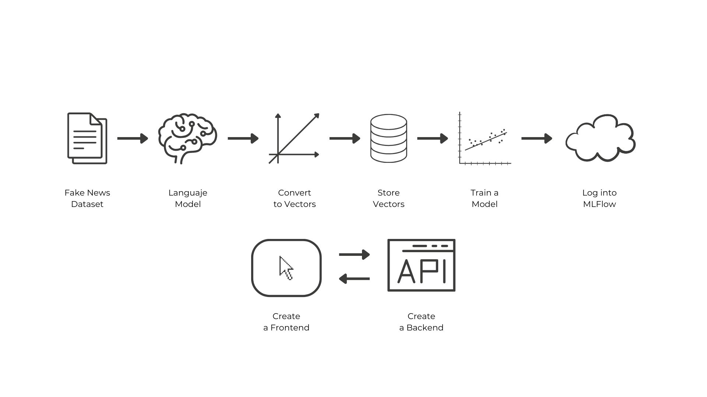

# Fake News Detection Project

Welcome to our **Fake News Detection Project, where we embark on a journey to build a robust system that can determine the authenticity of news articles**. In a world inundated with information, the ability to distinguish between real and fake news is crucial.

!!! success "Real Project from the ground up"

    We'll begin by creating a solid development environment, leverage cutting-edge Natural Language Processing (NLP) techniques to convert news articles into meaningful embeddings, and train a machine learning model capable of making accurate predictions. 

Throughout this project, we will embrace best practices in **software development, version control, and containerization** to ensure reproducibility and ease of deployment. Our goal is to not only develop a powerful tool but also to** learn and grow as we build a project from the ground up**. Let's get started on this exciting journey towards a more informed and discerning world!

## Project Overview

1. [Create a virtual environment](virtual_environments.md)
2. [Start a new project using Poetry](poetry.md)
3. [Manage the repository using GIT](git.md)
4. [Download dataset from Kaggle](https://www.kaggle.com/datasets/clmentbisaillon/fake-and-real-news-dataset/data)
5. Docker-Compose: Create environment with MLFlow
6. Use a sentence transformers model to transform news to vectors.
7. Retrieve the embeddings and Train a single model on those embeddings and register to MLFlow
8. Docker-Compose: Add a service that takes the latest model from MLFlow and crates an API
9. Create a Streamlit App that calls the API and returns a response
10. Dockerize Streamlit App and add it to the docker compose
